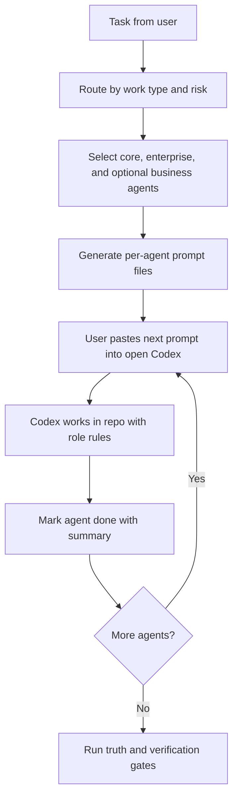

# Phere Codex Handoff Queue Plan

This reference trains the Phere 9-Agent Manager to run Phase 1 without paid API workers.

## Goal

Create a local queue of role-specific prompts for the already-open Codex app.

The queue must be:

- Free to run.
- Manual and human-visible.
- Safe for a dirty working tree.
- Evidence-based.
- Clear about what it can and cannot do.

## Architecture



## Commands

```bash
npm run agents:handoff -- "task"
npm run agents:handoff-next
npm run agents:handoff-next -- tester
npm run agents:handoff-status
npm run agents:handoff-done -- frontend "summary"
```

## Queue Files

- `.agents/handoff/PHERE_CODEX_HANDOFF_QUEUE.json`
- `.agents/handoff/PHERE_CODEX_HANDOFF_QUEUE.md`
- `.agents/handoff/tasks/<queue-id>/NN-agent.md`

These are local runtime files and should remain ignored.

## Prompt Rules

Every generated agent prompt must include:

- The agent id and mission.
- The original task.
- Route context: work type, risk, reason for selecting the agent.
- Files to read first.
- Guardrails for secrets, production, destructive actions, and unrelated user changes.
- Truthfulness rules.
- Expected output.
- The `agents:handoff-done` command.

## Safety Rules

- Never imply the queue controls Codex desktop directly.
- Never call paid APIs in this phase.
- Never put secrets into prompt files.
- Never deploy or touch production without explicit human approval.
- Never mark an agent complete without a truthful summary.
- Business agents stay disabled unless coding is verified or the user explicitly asks.

## Completion

The handoff queue is complete when all selected agents are marked `completed` and the final response includes:

- What changed.
- What was verified.
- What was not verified.
- Any source conflicts.
- Any assumptions or remaining risk.
