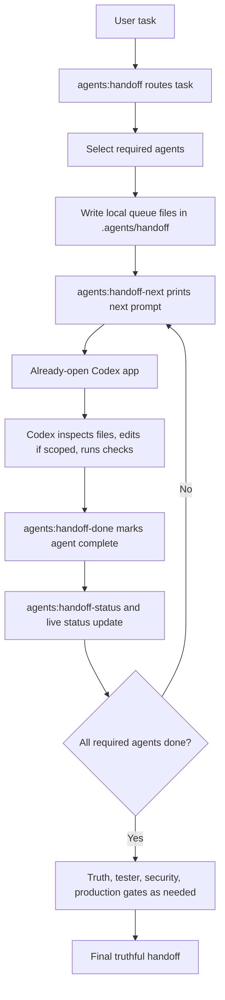

# Phere Codex Handoff Queue

Phase 1 is a free developer-side workflow for using the already-open Codex app as the worker.

It does not use OpenAI API workers, paid background LLM calls, or hidden automation. The repo creates a local queue of agent prompts. You open the next prompt, paste it into Codex, let Codex work in this same repo, then mark that agent done.

## What Agents Exist

The queue uses the same Phere 9-Agent Manager roster:

- Core engineering: `orchestrator`, `planner`, `product`, `frontend`, `backend`, `database`, `tester`, `production`, `security`
- Enterprise specialists: `architect`, `performance`, `observability`, `mobile`, `accessibility`, `documentation`, `data-ai`
- Optional business: `marketing`, `sales`, `customer-success`, `support`, `finance-strategy`, `legal-compliance`

Business agents stay parked until engineering is verified or the user explicitly asks for them.

## Commands

```bash
npm run agents:handoff -- "Saman feature, performance, and mobile layout"
npm run agents:handoff-next
npm run agents:handoff-status
npm run agents:handoff-done -- frontend "Saman UI reviewed and mobile risks listed"
```

Optional targeted next prompt:

```bash
npm run agents:handoff-next -- tester
```

## Workflow Diagram



## Local Files

| File or folder | Purpose |
|---|---|
| `.agents/handoff/PHERE_CODEX_HANDOFF_QUEUE.json` | Machine-readable queue state |
| `.agents/handoff/PHERE_CODEX_HANDOFF_QUEUE.md` | Human-readable queue state |
| `.agents/handoff/tasks/<queue-id>/NN-agent.md` | Per-agent prompt to paste into Codex |
| `.agents/status/PHERE_9_AGENT_LIVE_STATUS.md` | Live status mirror |
| `tools/phere-9-agent-manager.mjs` | CLI router and queue manager |

`.agents/handoff/` and `.agents/status/` are local runtime artifacts and are ignored by git.

## Rules

- Free/manual only: no paid API worker is used.
- The current open Codex app does the actual work after you paste a prompt.
- Queue files do not directly control Codex desktop.
- Start every agent handoff with `git status --short --untracked-files=all`.
- Protect unrelated user changes and generated files.
- Do not read, print, or expose secrets from `.env*`, tokens, keys, or credentials.
- Do not deploy, run production SQL, rotate secrets, delete data, or run destructive git commands without explicit human approval.
- Use one write owner per file whenever possible.
- Every feature change needs `tester`.
- Auth, RLS, secrets, exports, deletes, public routes, and finance-data risk need `security`.
- Build, release, env, APK, Capacitor, and deploy work need `production`.
- Claims such as tests passed, deployed, secure, production-ready, enterprise-ready, or shipped need direct evidence.

## Agent Output Contract

Each pasted Codex handoff should end with:

- Role used
- Files inspected
- Files changed
- Commands run and result
- Evidence for important claims
- Risks and assumptions
- Next agent needs

Then mark it done:

```bash
npm run agents:handoff-done -- <agent> "short truthful summary"
```

## What This Does Not Do

This does not create real autonomous background coding agents. It is a zero-cost handoff queue for the Codex app you already have open.

Future free local AI workers can be added later with Ollama/local models, following `.agents/skills/phere-9-agent-manager/references/PHERE_FREE_LOCAL_AI_WORKER_PLAN.md`.
